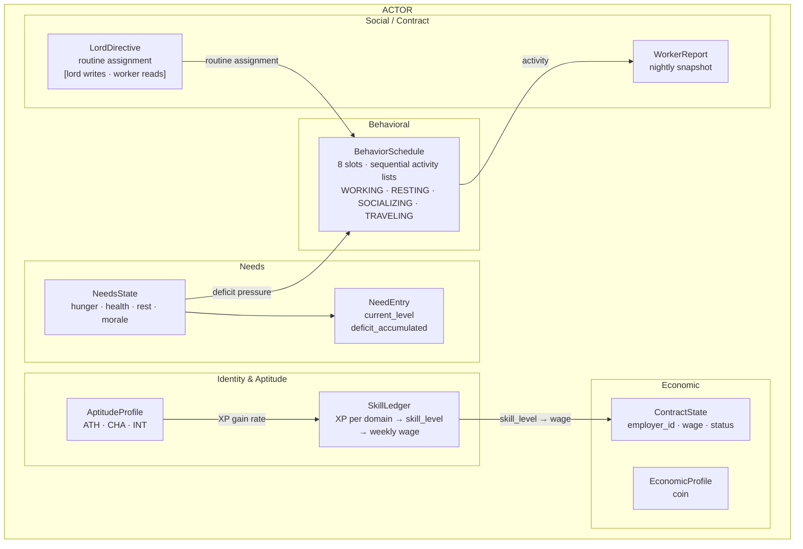
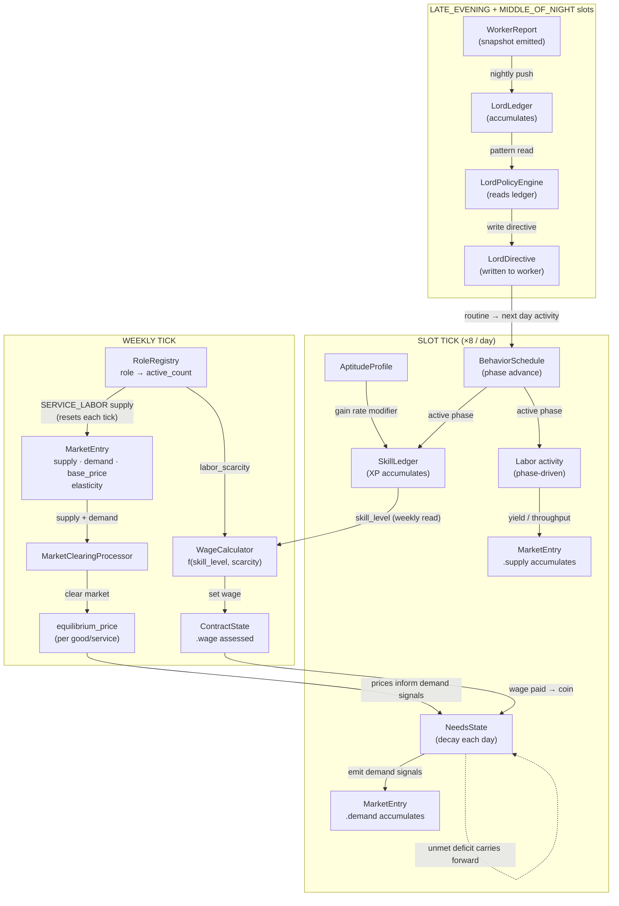

# The King You Don't See — Prototype Gaps Supplement

> **⚠ SUPERSEDED FOR PROTOTYPE SCOPE (2026-05-01):**
> The v0 prototype is a clean break from this document. The aptitude/skill/morale/lord-AI architecture below is **future-state**, not what gets built next. The v0 prototype is specified in `prototype-build-spec.md` — a much smaller economic-loop spine (tick → window → market → clearing) that this document's behavioral and cognitive layers will eventually run on top of.
>
> **Treat this document as future-vision reference, not a build target.** Specifically deferred from v0:
> - Three-layer actor model (Aptitudes → Skills/XP → Behavior/Economy)
> - Morale model and condition flags (HUNGRY, BROKE, UNABLE_TO_WORK, MARKET_SEEKING)
> - Work incapacity cause attribution
> - WorkerReport / LordLedger / LordPolicyEngine feedback loop and routine swapping
> - Doctor cascade as loop-(c) validation test
> - SERVICE_LABOR market type and RoleRegistry
> - All math placeholders in Section 11
>
> These return as targets in Epic 2+ once the v0 spine runs cleanly. Do not implement against this document until the build-spec foundation is in place.

**Status:** Future-state architecture reference (superseded for prototype scope)
**Original input to:** `/gds-game-architecture`
**Session dates:** 2026-04-27 (initial), 2026-04-29 (major revision — ground-up rebuild), 2026-05-01 (marked superseded for v0)

---

## Design Principle

Simple fundamental underlying concepts → drive systems → drive behaviors onto the world.

Every layer reads from the layer below and writes to the layer above. Do not skip layers.

---

## Section 1 — Canonical Vocabulary

These terms are canonical across all design and implementation discussions.

| Term | Definition |
|---|---|
| **Time Slot** | One of 8 named periods in a day: `EARLY_MORNING`, `MID_MORNING`, `LATE_MORNING`, `EARLY_AFTERNOON`, `LATE_AFTERNOON`, `EARLY_EVENING`, `LATE_EVENING`, `MIDDLE_OF_NIGHT`. Each slot holds an ordered activity list that executes sequentially within that time window. |
| **Phase** | A discrete activity with a defined duration. Runs within a time slot's activity list until complete, then yields to the next phase in the list. Ephemeral — does not survive a save. Owned by `BehaviorSchedule`. |
| **Routine** | An ordered array of 8 slot definitions — one per time slot — where each slot definition is an ordered list of phases to execute sequentially within that window. Data, not logic. Assigned via `LordDirective`. |
| **Routine Variant** | A named 8-slot routine configuration. Initial variants: `STANDARD_ROUTINE`, `DOUBLE_SHIFT_ROUTINE`. Swaps take effect at the next `EARLY_MORNING` slot only. |
| **Interrupt** | An `event_interrupt` signal that breaks the current phase mid-cycle. Sourced from the SimClock event queue. |
| **Planned Deviation** | A self-scheduled phase departure (e.g., traveling to a non-local market). Distinct from Interrupt — lower authority, cancellable by a lord Interrupt, carries a `return_routine` reference. |
| **Headless Event** | A sim-layer event with no active-layer representation. Processors handle silently. |
| **Latent Event** | A sim event that *could* surface to the active layer. Emits a self-contained payload to the event bus. If nothing is listening, it disappears harmlessly. |
| **Demand Signal** | An emission from an actor's `NeedsState` to a `MarketEntry`. Represents quantity the actor wants to purchase at equilibrium price. Aggregated by the market; not a peer-to-peer transaction. |
| **Equilibrium Price** | The price that emerges from market clearance each weekly tick. Derived from supply vs. aggregate demand. Never assigned directly. |
| **GOODS Market** | A market whose supply is populated from inventory stock (grain, tools, cloth). Supply persists and depletes across ticks. |
| **SERVICE_LABOR Market** | A market whose supply is populated from actor headcount via `RoleRegistry`. Supply resets to zero each weekly tick and is recalculated from current active producers. Cannot be stockpiled. |
| **WorkerReport** | A typed snapshot of a worker's state. Emitted at the start of the `LATE_EVENING` slot, received by `LordLedger`. |
| **LordDirective** | A resource on the worker actor. The lord writes it; the worker's `BehaviorSchedule` reads it. Never the reverse. |
| **LordLedger** | A node component on the lord actor. Accumulates `WorkerReport` entries: most-recent per worker, plus a rolling 7-night history. |
| **LordPolicyEngine** | A node component on the lord actor. Reads `LordLedger` at the `MIDDLE_OF_NIGHT` slot, applies AI decision logic, writes updated `LordDirective` resources to affected workers. |
| **RoleRegistry** | A per-region centralized map of `role → RoleEntry`. The authoritative source for labor supply counts. Updated on actor hire, death, or role change. |
| **WageCalculator** | A stateless autoload. Pure function. Computes wage from skill level, job category, and labor scarcity from `RoleRegistry`. Called on weekly tick only. |
| **deficit_accumulated** | A float on `NeedEntry`. Tracks how long and how severely a need has gone unmet. The cascade driver — feeds health deterioration, productivity penalty, morale drain. |

---

## Section 2 — Actor Architecture

### 2.1 — The Three Layers

**Layer 1 — Aptitudes** (foundational, static at spawn)
- `Athleticism (ATH)` — drives physical skill gain rates (farming, smithing, combat)
- `Charisma (CHA)` — drives social skill gain rates (bartering, leadership, negotiation)
- `Intelligence (INT)` — drives cognitive skill gain rates (market perception, financial evaluation, planning)

Zero on any aptitude is valid. It rewards sandbox builds and reflects genuine specialization.

**Layer 2 — Skills / XP** (accumulated through activity)

XP gain per skill per tick:

```
xp_gain = base_xp * (w_ATH * ATH + w_CHA * CHA + w_INT * INT)
```

Where `[w_ATH, w_CHA, w_INT]` is a weight vector declared per skill. Weights sum to 1.0. Zero weights are valid (e.g., market perception has near-zero ATH weight).

**Prototype skill domains and their weight vectors:**

| Skill | w_ATH | w_CHA | w_INT | Primary driver |
|---|---|---|---|---|
| Labor (farming, smithing) | 0.8 | 0.1 | 0.1 | ATH |
| Combat | 0.8 | 0.1 | 0.1 | ATH |
| Market Perception | 0.05 | 0.15 | 0.8 | INT |
| Bartering | 0.1 | 0.7 | 0.2 | CHA |

*Weight vectors are tuning data, not code. Stored in a resource file per skill. Changing a vector is a spreadsheet edit, not a code change.*

**Layer 3 — Skill Effects on Behavior and Economy**

- **Labor skill** → production output multiplier
- **Market perception skill** → reduces error/bias when reading equilibrium price (`P* + error(perception_skill)` — high skill = tighter error band)
- **Bartering skill** → shifts final negotiated price toward the actor's favor within a negotiation band
- **Combat skill** → damage/defense modifiers (deferred)

Wage is also a function of skill level — see Section 5.

### 2.2 — Actor Component Model

```
Actor (Node)
├── AptitudeProfile   (Resource)  — ATH, CHA, INT; static at spawn; write-once read-many
├── SkillLedger       (Resource)  — XP per skill domain, derived skill_level; read by WageCalculator weekly
├── EconomicProfile   (Resource)  — coin [prototype: coin only; goods_held deferred]
├── NeedsState        (Resource)  — hunger, health, rest, morale; each backed by a NeedEntry
├── ContractState     (Resource)  — employer_id, wage (assessed weekly), contract_status
├── LordDirective     (Resource)  — routine assignment; lord writes, worker reads
├── BehaviorSchedule  (Node)      — current_slot: TimeSlot (0–7), current_phase_index: int; advances slot_tick at slot boundary; executes each phase in slot's activity list sequentially; consults LordDirective and NeedsState
└── RoleCapabilities  (Node)      — [DEFERRED from prototype; RoleRegistry headcount sufficient]
    └── FarmerCapability / DoctorCapability / etc.
```

**NeedEntry** (one per need within NeedsState):
```
NeedEntry:
  current_level: float        # 0.0 = fully unmet, 1.0 = fully satisfied
  deficit_accumulated: float  # cascade driver; sum of unmet need over time
  last_resolution_tick: int
```

**Key principles:**
- Actor is a Node that owns components, not a flat struct.
- Resources = durable, serializable, high-frequency-read data.
- `BehaviorSchedule` is a Node because it receives signals and can be replaced on role change.
- Processors receive the actor node and query components — never switch on a role enum.

### 2.3 — Lord Actor Components

```
Lord Actor (Node)
├── AptitudeProfile   (Resource)
├── SkillLedger       (Resource)
├── EconomicProfile   (Resource)
├── NeedsState        (Resource)  — lords have needs (abstracted in early epics)
├── ContractState     (Resource)  — obligations to higher lords, tax agreements
├── LordTaxPolicy     (Resource)  — flat tax rate; readable by merchants and market processor
├── LordLedger        (Node)      — accumulates WorkerReports from all managed workers
└── LordPolicyEngine  (Node)      — reads ledger at day_tick; writes LordDirectives
```

### 2.4 — Merchant Actor Components

```
Merchant Actor (Node)
├── AptitudeProfile       (Resource)
├── SkillLedger           (Resource)
├── EconomicProfile       (Resource)
├── NeedsState            (Resource)
├── MerchantInventory     (Resource)  — goods held, cost basis, target sale price
├── MerchantPricingModel  (Resource)  — expected_sale, farm_gate ref, lord_tax rate, target_margin
├── BehaviorSchedule      (Node)      — same structure as worker; slot activity lists include phases such as BUYING, TRAVELING, SELLING, RESTING; multi-phase sequences within a slot are valid (e.g., BUYING then RESTING in the same morning slot)
└── TradeCapability       (Resource)  — goods handled, licensed markets
```

No `LordDirective` on Merchant. The merchant's "directive" is profit, derived from `MerchantPricingModel` by `merchant_planning_processor`.

---

## Section 3 — Morale Model

Morale is a float in `NeedsState`. One drain source, one recovery source.

| Event | Morale Effect |
|---|---|
| Actor completes a WORKING phase | Decrements morale by `work_morale_cost` |
| Actor completes a SOCIALIZING phase | Increments morale by `social_morale_recovery` |
| RESTING phase | No morale effect (restfulness recovery only) |

`DOUBLE_SHIFT_ROUTINE` removes SOCIALIZING. Without recovery, morale drains monotonically until the work incapacity threshold is crossed.

**Tuning parameters** (not locked — requires playtesting; live in archetype config, not hardcoded):
- `work_morale_cost`
- `social_morale_recovery`
- `morale_incapacity_threshold`

**Balance contract:** Morale must drain gradually. There is a warning band between "morale feels bad" and `UNABLE_TO_WORK`. A lord reading their ledger has at minimum 2–3 nights to intervene before incapacity.

---

## Section 4 — Condition States

Four condition states. Flags that modify or suspend the routine. They are not phases.

| Flag | Meaning | Upstream Inputs |
|---|---|---|
| `HUNGRY` | Food need is unmet | Hunger `NeedEntry.current_level` crosses threshold |
| `BROKE` | Cannot afford goods at current equilibrium price | Coin in `EconomicProfile` vs. market price |
| `UNABLE_TO_WORK` | Actor cannot perform labor this tick | Terminal output of morale collapse, food failure, or economic squeeze |
| `MARKET_SEEKING` | Actor is pathfinding to a non-local market | Price differential exceeds travel cost (actor has sufficient coin) |

`HUNGRY` and `BROKE` are inputs to `UNABLE_TO_WORK`, not synonyms.

---

## Section 5 — Work Incapacity Cause Attribution

`UNABLE_TO_WORK` alone is not actionable. The lord needs to know why.

```gdscript
enum WorkIncapacityCause {
    NONE,
    MORALE_COLLAPSE,
    FOOD_ABSENT,
    FOOD_UNAFFORDABLE,
    COMPOUNDING,
    # Reserved: GRIEF_TRAUMA, ILLNESS
}
```

| Cause | Lord Response | Problem Type |
|---|---|---|
| `MORALE_COLLAPSE` | Change routine, grant rest | Management — internal |
| `FOOD_ABSENT` | Supply-side action (trade routes, production) | Logistics — external |
| `FOOD_UNAFFORDABLE` | Wage intervention, price caps, merchant pressure | Political-economic |
| `COMPOUNDING` | Multiple interventions required | Systemic failure |

---

## Section 6 — Market Architecture

### 6.1 — Demand Signal Model

Actors do not transact peer-to-peer. The flow is:

```
NeedsState (actor) → emits demand signals → MarketEntry.demand (aggregated)
RoleCapabilities / labor → emits supply → MarketEntry.supply
MarketClearingProcessor (weekly tick) → clears supply vs. demand → equilibrium_price
```

The market is the coordination surface. It holds running balances. Prices emerge from clearance — never from direct assignment.

### 6.2 — MarketEntry

One entry per good or service in the market:

```
MarketEntry:
  good_id: StringName
  market_type: MarketType      # GOODS or SERVICE_LABOR
  supply: float                # units available this tick
  demand: float                # aggregate demand signals received this tick
  equilibrium_price: float     # output of clearance; read by actors for purchase decisions
  base_price: float            # anchor — prevents drift to zero or infinity
  price_elasticity: float      # how aggressively price responds to supply/demand imbalance
  supply_source_count: int     # distinct producers contributing; collapse detector
```

**Prototype note:** `price_last_tick` and rolling price history are deferred. Needed for merchant P&L and player dispatch system, not for prototype emergence validation.

### 6.3 — MarketType Enum

```gdscript
enum MarketType {
    GOODS,          # supply from inventory stock; persists and depletes across ticks
    SERVICE_LABOR,  # supply from RoleRegistry headcount; resets to zero each weekly tick
}
```

**GOODS:** Grain harvested this week adds to the existing market balance. Supply persists until sold.

**SERVICE_LABOR:** Healthcare supply = `active_doctors × visits_per_doctor_per_week`. Recalculated fresh each weekly tick. Cannot be stockpiled. When 2 of 3 doctors die, supply drops to 1/3 on the next tick — no gradual drain.

### 6.4 — Price Clearance Formula

```
[MATH PLACEHOLDER — equilibrium price clearance]

Directional formula:
  price = base_price * (1 / (supply / (demand + ε))) ^ (1 / price_elasticity)

Parameters to define in second pass:
  - ε (demand floor — prevents division by zero)
  - price_elasticity values per good category
  - price ceiling/floor bounds
  - how base_price is initialized and updated over time
```

### 6.5 — RoleRegistry

Centralized per-region. The authoritative source for SERVICE_LABOR supply and wage scarcity inputs.

```
RoleRegistry (per region):
  region_id: StringName
  roles: Dictionary[StringName, RoleEntry]

RoleEntry:
  role_id: StringName
  active_count: int            # alive and working actors with this role
  capacity_per_unit: float     # output per actor per weekly tick
  total_supply: float          # = active_count * capacity_per_unit; read by SERVICE_LABOR markets
```

**Death propagation:** `ActorDeathEvent → RoleRegistry.roles[role].active_count -= 1`

The event touches only the registry. Wage and price effects are pulled by the weekly tick systems that query the registry. The death event never writes directly to wage tables or market prices. That coupling would break migration, resurrection, and role-switching.

### 6.6 — The Labor Cascade (Example: Doctor Scenario)

*This scenario is the prototype's emergence validation test for loop (c).*

Region has 3 doctors. Evil actor kills 2.

1. `RoleRegistry.roles["doctor"].active_count` drops 3 → 1 on next tick.
2. **Weekly tick:** Healthcare `MarketEntry.supply` recalculates to `1 × capacity_per_unit` (was 3×). Demand signals unchanged. `equilibrium_price` spikes.
3. **Weekly tick:** `WageCalculator` reads scarcity from `RoleRegistry` — surviving doctor's wage jumps.
4. Actors whose coin cannot clear the new healthcare price have unmet health needs. `NeedEntry.deficit_accumulated` starts building.
5. Accumulated health deficit → productivity loss → labor output falls → GOODS supply drops → other market prices shift.
6. Medical supply (herbs, bandages) `MarketEntry.demand` drops (only 1 doctor consuming inputs vs. 3). Medical goods `equilibrium_price` falls. Merchants holding medical inventory take losses.

This cascade is not scripted. It is the default behavior of a correctly built system.

**Feedback loop brake (required before cascade goes live):** Without a stabilizing mechanism, the cascade can empty a region in ~30 ticks. The brake mechanism — charity/temple supply floor, migrant attraction over N ticks, or similar — must be designed before the full cascade is activated in the prototype.

---

## Section 7 — Wage System

### 7.1 — Wage Formula

```
[MATH PLACEHOLDER — full wage formula]

Directional formula:
  wage = base_wage * skill_modifier * scarcity_modifier

Where:
  skill_modifier  = f(skill_level)            — concave power curve, fast early / slow ceiling
  scarcity_modifier = f(labor_supply_count)   — inverse relationship; fewer workers = higher multiplier

Parameters to define in second pass:
  - skill_modifier curve shape and exponent per job_category
  - scarcity_modifier formula and elasticity
  - base_wage values per job_category
  - relative supply baseline per worker type (what counts as "normal" supply)
```

### 7.2 — Wage Assessment

- **Weekly tick only.** Wage is not continuous.
- Wage locks to the actor's assessed skill level at last assessment. Productivity fluctuates daily with morale; wage does not.
- This creates intentional lag asymmetry: a lord may be paying peak wages for declining output (morale collapse) or pre-promotion wages for a secretly-leveled worker (opportunity for the alert lord).

### 7.3 — Wage Independence from Productivity

Morale drops productivity output. Morale does not drop wage. These are separate calculations enforced by architecture — `WageCalculator` is a pure function that never reads morale. Productivity multiplier lives in the production processor, not in `WageCalculator`.

```gdscript
# WageCalculator.gd (Autoload — pure function)
func calculate_wage(skill_level: float, job_category: StringName, region_id: StringName) -> float:
    var config = WAGE_CONFIG[job_category]
    var scarcity = RoleRegistry.get_scarcity(job_category, region_id)
    return config.base_wage * _skill_modifier(skill_level, config) * _scarcity_modifier(scarcity)
    # [MATH PLACEHOLDER — _skill_modifier and _scarcity_modifier implementations]
```

---

## Section 8 — Tick Architecture

Three tick cadences. Canonical phase order within each tick must be treated as a contract — violating it produces bugs that are extremely difficult to trace.

### Slot Tick (fires 8 times per day — once per time slot, in order):

Canonical processing order per slot:
1. `BehaviorSchedule` advances to the next slot; resolves active phase from slot's activity list (reads `LordDirective` and `NeedsState`)
2. `NeedsState` decay (hunger, health, rest, morale — scaled to 1/8 of daily rate per slot)
3. XP accumulation (activity in current phase → `SkillLedger`)
4. Demand signal emission (`NeedsState` → `MarketEntry.demand`)
5. Supply contribution (active work phase → `MarketEntry.supply` for GOODS markets)

**`LATE_EVENING` slot additional step (runs at slot start, before step 1):**
- `WorkerReport` emitted by each worker; `LordLedger.receive_report()` accumulates

**`MIDDLE_OF_NIGHT` slot additional step (runs after step 5):**
- `LordPolicyEngine` reads `LordLedger`, writes updated `LordDirective` resources to affected workers

### Weekly Tick (canonical phase order):
1. Deaths/arrivals processed → `RoleRegistry` updated
2. SERVICE_LABOR supply recalculated from `RoleRegistry` → `MarketEntry.supply` reset
3. Demand signals aggregated (sum of all daily signals since last clearance)
4. `MarketClearingProcessor` runs — clears all MarketEntries, sets `equilibrium_price`
5. `WageCalculator` runs — reads `SkillLedger` + `RoleRegistry` scarcity, writes to `ContractState.wage`
6. `LordPolicyEngine` evaluates `LordLedger`, writes `LordDirective` updates

---

## Section 9 — Prototype Component Scope

**Three validation loops the prototype must prove:**
- **(a)** Aptitude → XP → skill differentiation: different aptitude builds produce measurably different skill trajectories
- **(b)** Needs → demand signals → price emergence: NeedsState decay drives market demand; market clearance produces emergent equilibrium prices
- **(c)** Labor supply shock → wage and price cascade: removing an actor from RoleRegistry produces wage spike, service price spike, and secondary supply effects

### IN (prototype required):

| Component | Justification |
|---|---|
| `AptitudeProfile` (ATH, CHA, INT) | Root of loop (a) |
| `SkillLedger` + XP formula | Loop (a) output |
| `NeedsState` + `NeedEntry` (deficit_accumulated) | Root of loop (b); cascade driver |
| `EconomicProfile` (coin only) | Wage receive, purchase ability |
| `BehaviorSchedule` (phase enum + daily tick) | Context for needs decay and XP accumulation |
| `MarketEntry` (supply, demand, equilibrium_price, base_price, elasticity) | Loop (b) target |
| `MarketType` enum (GOODS + SERVICE_LABOR) | Required for loop (c) |
| `RoleRegistry` (active_count + capacity_per_unit) | Labor scarcity signal source |
| `MarketClearingProcessor` (weekly tick) | Price emergence mechanism |
| `WageCalculator` autoload | Loop (c) wage output |
| `LordDirective` (routine assignment only) | Minimal assignment path |
| `ContractState` (employer_id, wage, status) | Wage attachment to actor |

### DEFERRED (post-prototype):

| Component | Notes |
|---|---|
| `WorkerReport` + `LordLedger` | Lord feedback loop; not needed to validate (a)(b)(c) |
| `LordPolicyEngine` | Zero value without LordLedger |
| `RoleCapabilities` (FarmerCapability, DoctorCapability, etc.) | RoleRegistry headcount sufficient for prototype |
| `goods_held` in EconomicProfile | Peer inventory not needed while market holds supply |
| `MerchantInventory`, `MerchantPricingModel` | Merchant actor complexity deferred |
| Full `deficit_accumulated` graduated response | Track float; use binary threshold trigger only |
| `price_last_tick` / price history | Analytics, not mechanics |
| Feedback loop brake mechanism | Required before cascade goes live in production |

### Prototype Simplifications:

- `BehaviorSchedule`: 8-slot array; each slot holds an ordered activity list. `current_slot` (0–7) + `current_phase_index` advance each slot_tick. No transition graph.
- `MarketEntry`: omit price history. equilibrium_price + base_price sufficient.
- `EconomicProfile`: coin only. Money circuit: lord pays wage → actor holds coin → actor emits demand.
- `WageCalculator`: skill_level + labor_scarcity inputs only. job_category as placeholder enum.
- `RoleRegistry`: active_count + capacity_per_unit only. No vacancy logic or history.

---

## Section 10 — Signal Flow Reference

### Actor Component Map



### System Signal Flow (by tick cadence)



---

## Section 11 — Math Specifications [SECOND PASS]

All formulas below are stubs. Values and curve shapes to be defined and validated in the second implementation session.

### 11.1 — XP Gain Formula

**Locked:**
- Aptitude scale: **1–10 integer**
- Skill is a **continuous XP float** — no discrete level conversion. `skill_xp` accumulates indefinitely and is passed directly to per-skill effect functions.
- XP gain per activity per slot:
```
xp_gain = base_xp * (w_ATH * ATH + w_CHA * CHA + w_INT * INT)
```
With aptitudes 1–10 and weights summing to 1.0, the multiplier ranges from ~1.0 (minimum aptitudes) to ~10.0 (maximum), giving roughly a 3× spread across realistic character builds for any given skill.

**Per-skill effect curves** — each skill maps `skill_xp → behavioral_effect` using its own curve shape. Downstream formulas (wages, production, perception error) consume `skill_effect(skill_xp)`, not raw XP.

| Skill | Curve Type | Character |
|---|---|---|
| Labor (farming, smithing) | `LOGARITHMIC` | Easy to learn, hard to master — quick early gains, long road to mastery |
| Combat | `S_CURVE` | Hard to start, accelerates through practice, diminishing returns at elite level |
| Market Perception | `S_CURVE` | Slow start (insight required before it clicks), then accelerates |
| Bartering | `LINEAR` | Steady improvement, no dramatic inflection |

```
[MATH PLACEHOLDER — per-skill curve parameters]
- base_xp per activity type (working one slot, trading one transaction, etc.)
- Weight vectors per skill domain (prototype table in Section 2.1 is directional only)
- LOGARITHMIC params: a, b per skill (f(xp) = a * log(1 + xp/b))
- S_CURVE params: a, b, c per skill (f(xp) = a / (1 + e^(-b*(xp-c))))
- LINEAR param: a per skill (f(xp) = a * xp)
```

### 11.2 — Market Clearance / Equilibrium Price
```
price = base_price * (demand / (supply + ε)) ^ (1 / price_elasticity)

[MATH PLACEHOLDER]
- ε value (demand floor)
- price_elasticity values per good category (food more inelastic than luxury goods)
- Price ceiling and floor bounds per good
- base_price initialization and drift rules
- How demand signals are normalized (per-actor quantity vs. weighted by urgency)
```

### 11.3 — Wage Formula
```
wage = base_wage * skill_modifier(skill_effect(skill_xp)) * scarcity_modifier(supply_count, baseline)

[MATH PLACEHOLDER]
- skill_modifier curve: shape and range per job_category (consumes per-skill effect output, not raw XP)
- scarcity_modifier: supply count vs. regional baseline; elasticity of wage response
- base_wage values per job_category
- "Normal" supply baseline per role (what counts as non-scarce)
- Wage floor (minimum wage actors will accept before contract breach)
```

### 11.4 — Market Perception Error Model
```
perceived_price = true_equilibrium_price + error(market_perception_skill)

[MATH PLACEHOLDER]
- Error distribution shape (Gaussian? asymmetric bias for low-skill actors?)
- Error magnitude as function of skill_level
- Whether starting bias is directionally wrong (not just noisy) — design intent: yes
- How error shrinks as skill rises (linear? logarithmic?)
```

### 11.5 — Production Output

**Locked:**
```
slot_output = land_area * base_yield_per_slot * plot_productivity

plot_productivity = min(Σ worker_productivity_i, 1.0)   # worker cap — overstaffing adds nothing

worker_productivity = skill_contribution(skill_xp) * morale_fraction(morale)
```

Skill and morale both feed into `productivity` — not stacked independently on top of `slot_output`. Skill sets the ceiling (what the worker is capable of at peak); morale determines what fraction of that ceiling is actually applied. Output is produced per WORKING slot and writes to owner inventory immediately.

```
[MATH PLACEHOLDER — tuning parameters]
- base_yield_per_slot per role/plot type
- skill_contribution curve: LOGARITHMIC; novice floor and shape (params deferred to playtesting)
- morale_fraction: flat 1.0 above comfort threshold, linear degradation through warning band,
  hard zero at incapacity threshold (exact thresholds deferred to playtesting)
```

---

## Section 12 — Open Design Questions (Carried Forward)

- **Feedback loop brake mechanism** — charity floor, migrant attraction, or other stabilizer. Required before doctor cascade goes live.
- **Tick ordering contract** — canonical phase order within each tick must be documented as an implementation contract before any processor is written.
- **Production input signals vs. personal need signals** — both emit to the market, but they must be tagged differently so the lord can distinguish "my doctor needs food" from "my doctor needs herbs to work." Same market mechanism, different signal type.
- **Aptitude scale** — ~~resolved: 1–10 integer~~
- **Player aptitude visibility** — aptitudes should not be shown as raw numbers initially. Behavior leaks through. Steward/spy network unlocks visibility as a reward for attention.
- **Gaps 3 and 4 (world construction grammar and archetype extensibility)** — unresolved from original plan; deferred until prototype validates core economic loop.

---

*This document is a living supplement. Math placeholders in Section 11 to be resolved in a dedicated implementation session.*
